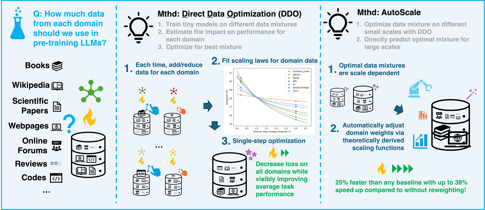
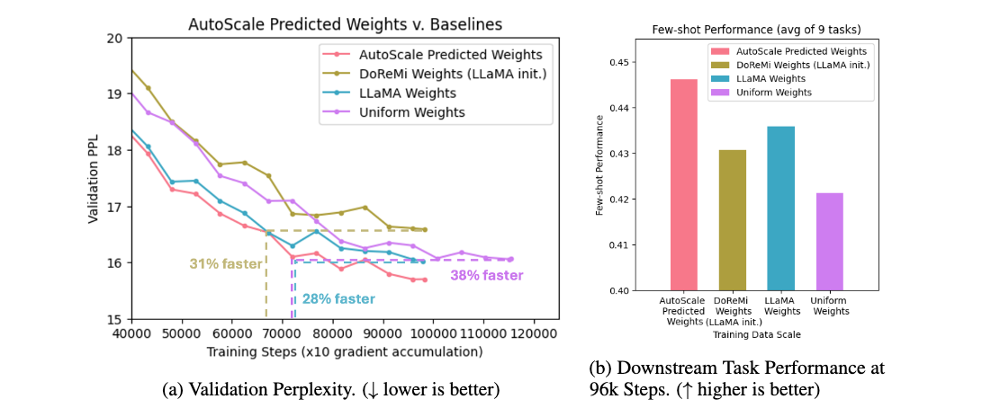
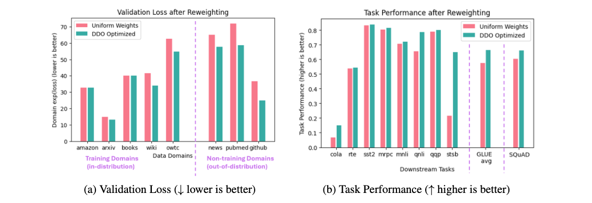
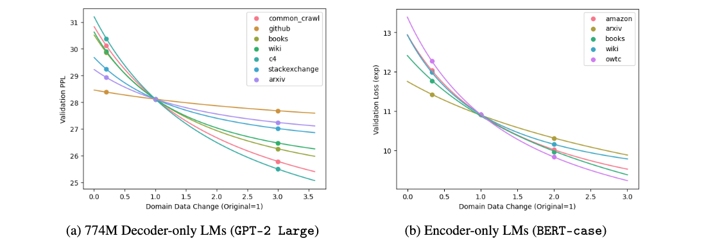
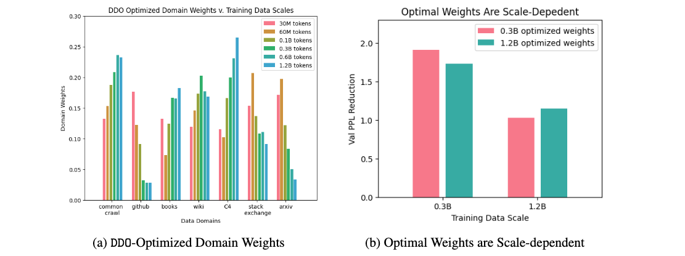
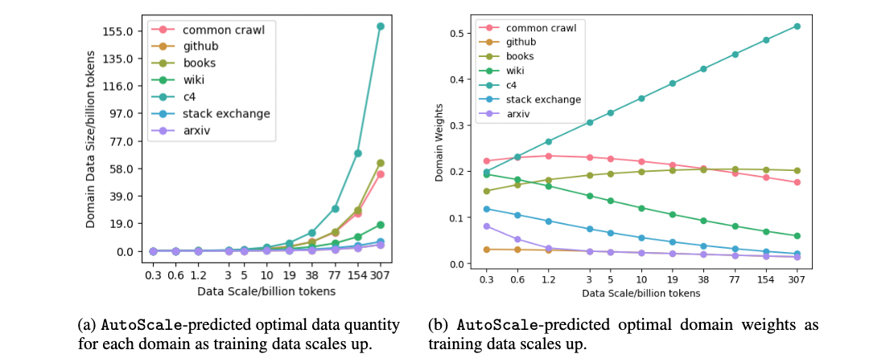

#### Official Code Repository for 
# AutoScale📈–Automatic Prediction of Compute-optimal Data Compositions for Training LLMs

**Abstract:** To ensure performance on a diverse set of downstream tasks, LLMs are pretrained via data mixtures over different domains. In this work, we demonstrate that the optimal data composition for a fixed compute budget varies depending on the scale of the training data, suggesting that the common practice of empirically determining an optimal composition using small-scale experiments will not yield the optimal data mixtures when scaling up to the final model. To address this challenge, we propose **AutoScale**, an automated tool that finds a compute-optimal data composition for training at any desired target scale. AutoScale first determines the optimal composition at a small scale using a novel bilevel optimization framework, **D**irect **D**ata **O**ptimization (**DDO**), and then fits a predictor to estimate the optimal composition at larger scales. The predictor's design is inspired by our theoretical analysis of scaling laws related to data composition, which could be of independent interest. In empirical studies with pre-training 774M Decoder-only LMs (GPT-2 Large) on RedPajama dataset, AutoScale decreases validation perplexity at least 25% faster than any baseline with up to 38% speed up compared to without reweighting, achieving the best overall performance across downstream tasks. On pre-training Encoder-only LMs (BERT) with masked language modeling, DDO is shown to decrease loss on all domains while visibly improving average task performance on GLUE benchmark by 8.7% and on large-scale QA dataset (SQuAD) by 5.9% compared with without reweighting. AutoScale speeds up training by up to 28%. Our codes are open-sourced.

**Figure 1.** LLMs are pre-trained using data from different sources or domains, yet determining the optimal data composition is challenging. We propose **AutoScale**, an automated tool that finds a compute-optimal data composition for training at any desired target scale. **AutoScale** first determines the optimal composition at a small scale using a novel bi-level optimization framework, **D**irect **D**ata **O**ptimization (**DDO**), and then fits a predictor to estimate the optimal composition at larger scales. The predictor's design is inspired by our theoretical analysis of scaling laws related to data composition, which could be of independent interest. In empirical studies, **AutoScale** decreases validation perplexity at least 25% faster than any baseline with up to 38% speed up compared to without reweighting, achieving the best overall performance across downstream tasks. 

**Figure 2.** Training 774M Decoder-only LMs for 10B tokens (96k steps). **AutoScale**-predicted domain weights decrease validation PPL at least $28\%$ faster than any baseline with up to $38\%$ speed up. LLaMA weights yield a much better training efficiency than uniform weights when scaling up.

## Algorithms
In this work, we propose a generic domain reweighting methodology for LLM pre-training to overcome these limitations. **Our efforts are two-fold:**

### 1. DDO

- We formalize the problem of finding compute-optimal data composition with domain reweighting as bi-level optimization. This allows for directly optimizing the final objective over data composition, circumventing most of the risks from heuristic designs. We propose a practical solution algorithm, **D**irect **D**ata **O**ptimization (**DDO**), for determining a compute-optimal training data composition for a given data scale by estimating and optimizing over the neural scaling law of the data sources. This provides a global approximation to this problem, which allows finding the global optimum in a *single step* with high precision, achieving consistent results and reliable performance improvements robust to different use cases.
  

**Figure 3.** Optimizing domain weights with **DDO** algorithm for pre-training Encoder-only LMs (*BERT*). **DDO** substantially reduces validation loss. After reweighting, all training domains' loss has either decreased or remained unchanged. Out-of-domain loss on non-training domains has also decreased considerably. Enhanced performance has been observed on all *GLUE* tasks and *SQuAD*.

**Operational Pipeline:**

**Stage 1, model training**
*(example training pipelines provided in /training/)*
- Train a base proxy model with uniform weights (or reference weights, if available);
- At each time, add/reduce data quantity for one domain and re-train the proxy model;

**Stage 2, optimization**
*(interactive examples provided in /algorithms/DDO_example.ipynb)*
- Enter the results for the experiments listed above;
- Fit power law scaling functions and solve the optimization problem.

**Figure 4.** Fitting validation loss with power-law functions, directly approximating how loss changes with each domain's data quantity. Compared to *BERT* models trained with MLM (right), *GPT* models trained with CLM (left) demonstrate a much stronger response to domain reweighting. In final results, *GPT*/CLM achieved >2x speed-up margins relative to uniform weights compared to *BERT*/MLM.

### 2. AutoScale

- We show that the shift in the optimal data composition with the scale of training complies with a simple function form and is empirically predictable. By fitting this pattern of shift at smaller scales, we are able to predict optimal data compositions at larger scales, automatically adjusting data composition for any training data scale and achieving beyond-neural scaling performance improvements on the target model. Correspondingly, we propose **AutoScale**, an automated tool that finds a compute-optimal data composition for training an LLM at the target scale. With optimal data compositions found at smaller scales, we fit the **AutoScale** predictor designed based on theoretical analysis with scaling laws and use it to determine optimal data composition at larger scales. Since one only needs to train models on small data scales where re-training is affordable, **AutoScale** *does not require using proxy models with a smaller parameter size, avoiding the transferability issue between domain weights optimized on different models*.

**Figure 5.** Optimizing domain weights with **DDO** algorithm for pre-training 774M Decoder-only LMs (*GPT-2 Large*). Optimal domain weights are dependent on the scale of training data. A consistent shift can be observed. Using domain weights optimized for a different scale yields sub-optimal results, failing to fully realize the benefits of domain reweighting.

**Operational Pipeline:**

**Stage 1, obtaining domain weights**
- For two smaller training data scales $N^{(1)}$ and $N^{(2)}$ where re-training the model is affordable, find their corresponding optimal training data compositions $\mathbf{N^{(1)\*}}$ and $\mathbf{N^{(2)*}}$ using **DDO** Algorithm described above.

**Stage 2, prediction**
*(interactive examples provided in /algorithms/AutoScale_example.ipynb)*
- Enter the optimized domain weights $\mathbf{N^{(1)\*}}$, $\mathbf{N^{(2)*}}$ from the experiments listed above;
- Predict the next optimal training data composition as $\mathbf{N^{(3)\*}}=\mathbf{N^{(2)\*}}(\mathbf{N^{(1)\*}})^{-1}\mathbf{N^{(2)\*}}$, yielding optimal domain weights $w_i^{(3)\*}=N_i^{(3)\*}/N^{(3)}$ at new training data scale $N^{(3)}=\sum_i N_i^{(3)\*}$;
- Repeat this process until the target training data scale is reached.

**Figure 6.** **AutoScale**-predicted domain weights for training 774M Decoder-only LMs. Optimal data quantity for each domain grows in exponential-style functions with training data scale (left) where data sources with diverse samples (e.g., *C4*) are unweighted relative to domains with standard format (e.g., *Wikipedia*).

## Additional Training Details

### Data

For training Decoder-only LMs, the **RedPajama** dataset is available at: https://huggingface.co/datasets/togethercomputer/RedPajama-Data-1T. The 7 domains involved are characterized as follows: 
- *Commoncrawl*: A vast repository of web-crawled data, providing a heterogeneous mix of internet text.
- *C4*: The Colossal Clean Crawled Corpus, filtered to remove low-quality content, thus ensuring the reliability and cleanliness of the data.
- *GitHub*: This domain includes a compilation of publicly available code repositories, offering a rich source of syntactic and semantic patterns inherent in programming languages.
- *Books*: A collection of textual content from published books, providing diverse narrative styles and complex character developments.
- *ArXiv*: Comprising scientific papers primarily from the fields of physics, mathematics, computer science, and quantitative biology, this domain offers high-quality, scholarly content.
- *Wikipedia*: A well-organized and meticulously curated dataset of encyclopedia articles, delivering a broad spectrum of knowledge across multiple disciplines. We only use English samples with 'en' in meta-data.
- *StackExchange*: This domain captures a variety of user-generated content from discussions and question-answer sessions across numerous technical topics.

Given copyright restrictions with the *Books* domain on Hugging Face, we have opted for an alternative source available at https://yknzhu.wixsite.com/mbweb.
For each domain, we ensure only samples with more than 1000 characters are retained. For each sample, we randomly extract a continuous block of 1000 characters. For the *Wikipedia* domain, we keep only those samples that are in English. Samples are selected without replacement. Additionally, for each domain, a held-out dataset comprising 10K samples is reserved to evaluate the perplexity of the pretrained model. 

For training Encoder-only LMs, the 5 domains of training data utilized are listed as follows:
- *Amazon Reviews*: A compilation of customer reviews from Amazon, widely utilized in sentiment analysis studies, available at: https://huggingface.co/datasets/amazon_us_reviews.
- *Arxiv*: Comprises 1.7 million articles from arXiv, available at: https://www.tensorflow.org/datasets/catalog/scientific_papers.
- *Books*: A corpus of 11,038 novels by unpublished authors across 16 genres, available at: https://yknzhu.wixsite.com/mbweb.
- *Wikipedia*: Offers datasets extracted from Wikipedia in various languages, available at: https://www.tensorflow.org/datasets/catalog/wikipedia. We only use English samples with 'en' in meta-data.
- *Open WebText Corpus (OWTC)*: A corpus of English web texts from Reddit posts, available at: https://skylion007.github.io/OpenWebTextCorpus/.
3 held-out non-training domains used in the evaluation include:
- *Pubmed*: Features 19,717 diabetes-related publications from the PubMed database, organized into three classes and linked by a network of 44,338 citations, available at: https://www.tensorflow.org/datasets/catalog/scientific_papers
- *News*: Comprises a significant collection of news articles derived from *CommonCrawl*, specifically from 5000 news domains indexed by Google News, available at: https://github.com/rowanz/grover/blob/master/realnews/README.md
- *GitHub*: A curated selection from the *RedPajama*} dataset, this segment includes an array of open-source code projects, available at: https://huggingface.co/datasets/togethercomputer/RedPajama-Data-1T

### Training

**For experiments on Decoder-only LMs (GPT-2 Large):** Run
1. prepare_raw_data.py
2. prepare_data.py
3. run_gpt2_large.sh
   
**For experiments on Encoder-only LMs (BERT-base):** Run
- Interactive example: simple_bert.ipynb

## Acknowledgement
> This work is supported in part by the National Science Foundation under grants IIS-2312794, IIS2313130, OAC-2239622, Amazon-Virginia Tech Initiative in Efficient and Robust Machine Learning, AWS computational credits, and the Commonwealth Cyber Initiative. The authors are grateful for Ankit Battawar and Alix Delgado from AWS, whose dedicated help and support were crucial for securing computing resources and implementing empirical studies.

## Citation
If you find the manuscript or the code repo helpful to your project, please consider adding the following citation

> []

The authors appreciate your support :)
